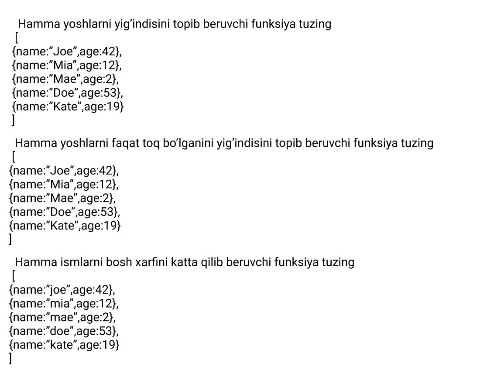

<!-- let sum = 0;
let person = 0;
let data = [
  { name: "John", age: 20 },
  { name: "John", age: 30 },
  { name: "John", age: 25 },
];
let obj = data.map((value) => {
  person++;
  sum += value.age;
});
console.log(`There are ${person}, and total age ${sum}`); -->

